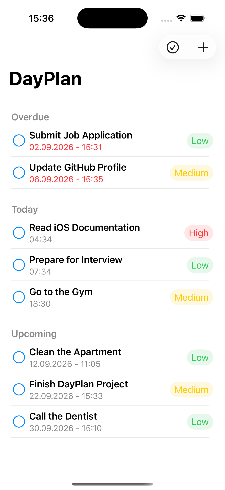
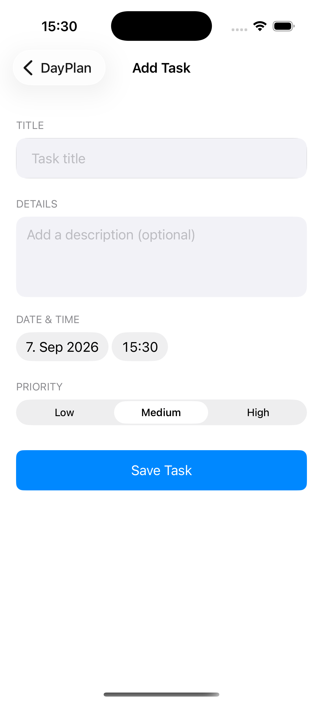
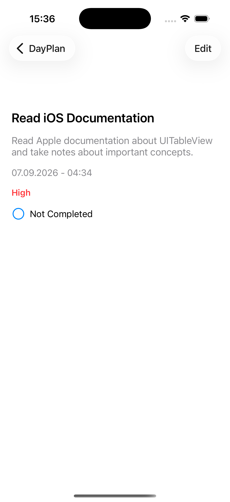
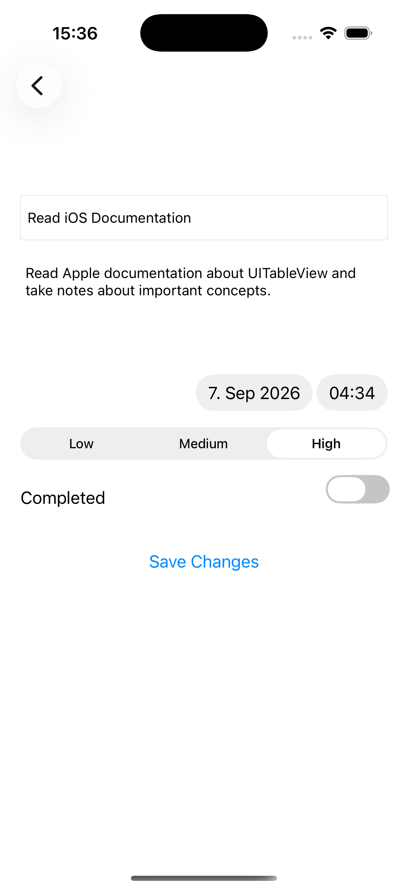
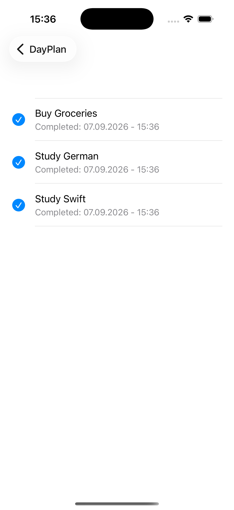
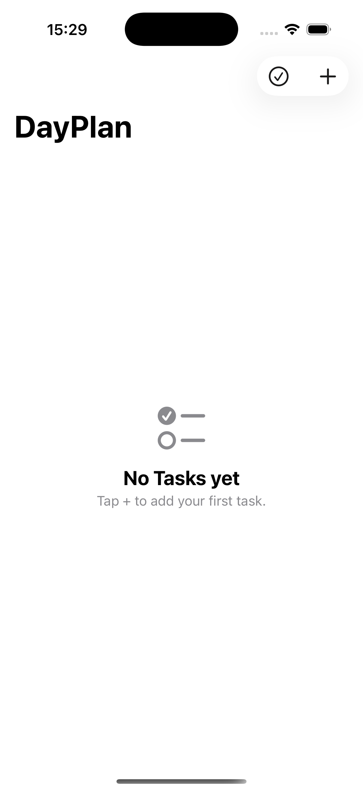
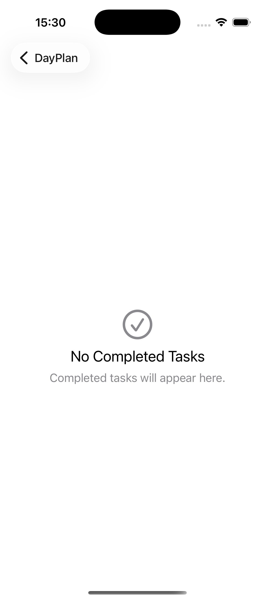

# DayPlan

DayPlan is a native iOS task management application built with **Swift, UIKit, Storyboard, MVVM, and Core Data**.

The project was developed as a practical iOS learning project with a focus on application architecture, local data persistence, task organization, and testing.

## 📱 Screenshots

<p align="center">
  
  
  
</p>

<p align="center">
  
  
</p>

<p align="center">
  
  
</p>

## ✨ Features

- Create tasks with title, description, date, time, and priority
- Edit existing tasks
- Delete tasks
- Mark tasks as completed
- Restore completed tasks
- Track task completion date and time
- Organize active tasks into **Overdue**, **Today**, and **Upcoming** sections
- View completed tasks in a separate history screen
- Automatically sort tasks by date
- Persist tasks locally using Core Data
- Low, Medium, and High priority levels
- Empty-state interfaces
- Dynamic table view cells
- Dark Mode support

## 🏗 Architecture

DayPlan follows the **MVVM (Model-View-ViewModel)** architecture.

The project separates responsibilities into:

- **Model** — Task data and priority types
- **View** — UIKit views and Storyboard interfaces
- **ViewModel** — Presentation and business logic
- **Data** — Core Data persistence layer

A `TaskDataManaging` protocol separates the ViewModels from the concrete Core Data implementation. This also makes dependency injection and testing easier.

## 🛠 Technologies

- Swift
- UIKit
- Storyboard
- MVVM
- Core Data
- Auto Layout
- UITableView
- SF Symbols
- Swift Testing
- XCTest
- Git & GitHub

## 🧪 Testing

The project includes automated tests for important application logic:

- ViewModel unit tests
- Core Data CRUD tests
- In-memory Core Data testing
- Mock data manager
- Dependency injection for isolated tests

UI tests are not included in the current version.

## 🎓 What I Practiced

While building DayPlan, I practiced:

- MVVM architecture
- Protocols and dependency injection
- Delegate pattern
- UITableView and custom cells
- Dynamic table view sections
- Navigation Controller and segues
- Core Data CRUD operations
- Persistent local storage
- UUID-based model identification
- Date filtering, formatting, and sorting
- Swift closures with `filter` and `sorted`
- Optionals
- Enums and raw values
- Auto Layout
- Programmatic UIKit layouts
- Self-sizing table view cells
- Semantic system colors and Dark Mode
- Empty-state interfaces
- Unit and integration testing

## 📂 Project Structure

```text
DayPlan
├── Model
├── View
├── ViewModel
├── Data
├── DayPlanTests
└── DayPlanUITests
```

## 📋 Requirements

- Xcode
- Swift
- iOS 17.0+

## 👤 Author

**Ahmet Cilingir**
